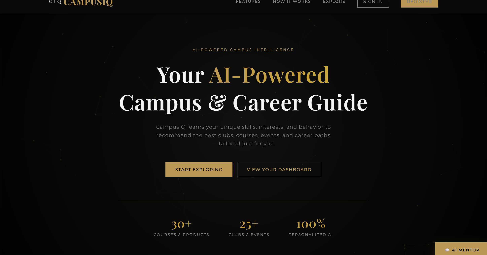
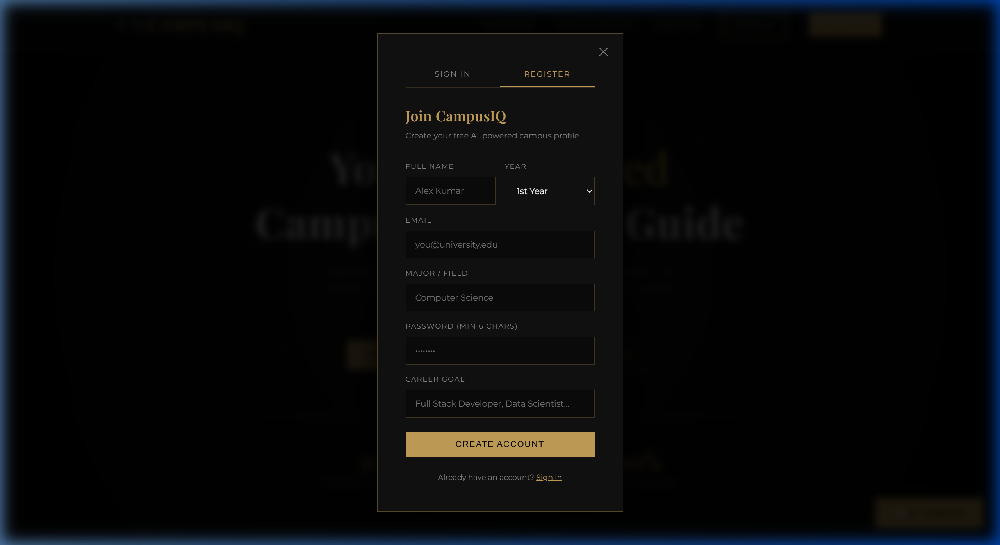
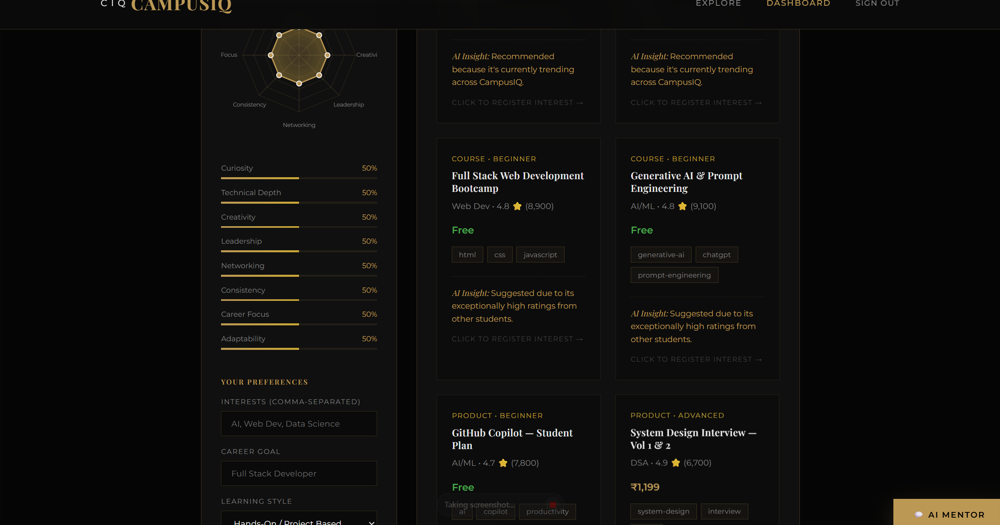
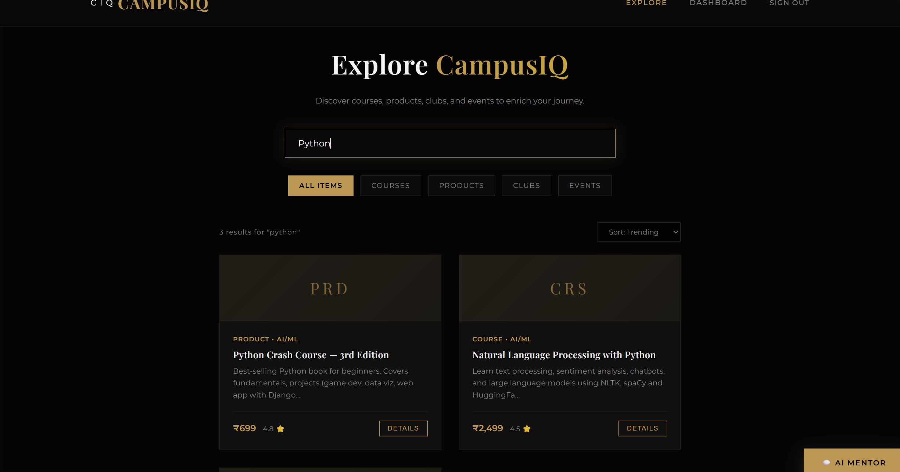
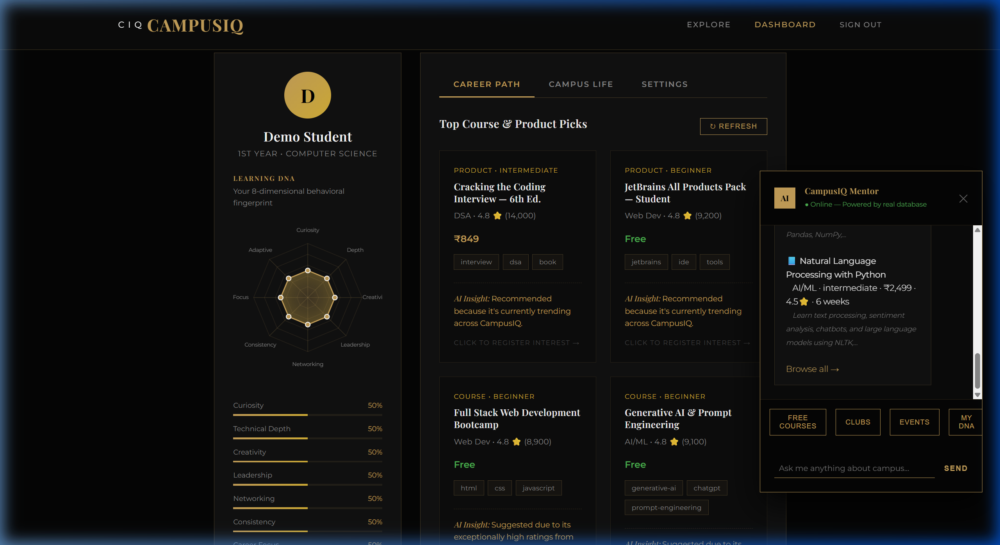
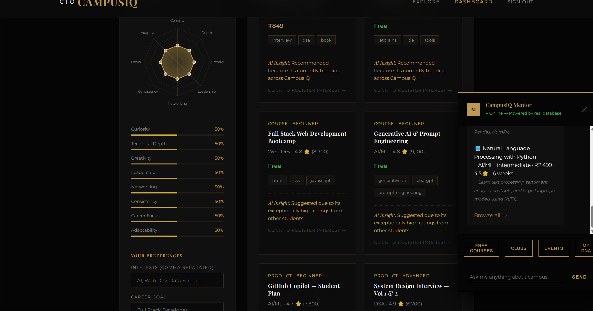

# CampusIQ AI

**An AI-powered web app that acts as a personal guide for college students — recommending courses, clubs, events, and career resources based on how they actually behave on the platform.**


---

## What this project is about

I built CampusIQ as my submission for the AI Web Development course. The core idea is simple: college students waste a lot of time figuring out what to learn, which clubs to join, or what events matter for their career. I wanted to build something that solves this automatically — not with a static list, but with real AI that adapts to each person.

The app tracks how a student interacts with the platform (what they click, enroll in, bookmark, or rate) and uses that data to build a personal preference profile. From there, it recommends the right content at the right time, and explains why.

---

## Screenshots

**Landing Page**


**Sign Up**


**Student Dashboard — Learning DNA + Recommendations**


**Explore Page — Browse Everything**


**Live Search in Action**


**AI Mentor Chatbot**


**DNA Dimension Breakdown**


> A full video walkthrough is available at `screenshots/recordings/campusiq_full_demo.webp`

---

## How the AI works

The recommendation engine lives in `server/ai-service.js` and does three things:

**1. Builds a user vector from behavior**
Every course, club, and event is represented as a 10-dimensional feature vector across categories like AI/ML, Web Dev, Cloud, Design, etc. When a student enrolls, bookmarks, or rates something, the system updates their personal preference vector accordingly — enrollments carry more weight than just clicks.

**2. Scores everything using cosine similarity**
When you load the dashboard, the engine computes the cosine similarity between your preference vector and every item in the database. That gives a content-based relevance score.

**3. Combines it with popularity and quality signals**
The final score is a weighted mix:
- 60% — Content similarity (matches your interests)
- 20% — Popularity (enrollment count, trending flag)
- 20% — Quality (average rating from other students)

There are two separate recommendation pipelines — one for courses and products (Career Brain), and one for clubs and events (Campus Brain).

**Learning DNA** is the 8-dimensional profile stored per student: Curiosity, Technical Depth, Creativity, Leadership, Networking, Consistency, Career Focus, and Adaptability. It gets updated based on interaction patterns and is visualized as a radar chart on the dashboard.

The chatbot uses regex-based intent detection against real MongoDB queries — no external API, just the live database and the recommendation engine.

---

## Tech stack

| Layer | What I used |
|---|---|
| Frontend | HTML, CSS, Vanilla JavaScript |
| Backend | Node.js, Express.js v5 |
| Database | MongoDB with Mongoose ODM |
| Auth | JWT (jsonwebtoken) + bcryptjs for password hashing |
| AI Engine | Custom JS — cosine similarity, hybrid scoring |
| Sentiment Analysis | AFINN lexicon (built-in, no external API) |
| Dev tooling | nodemon, dotenv |

No frameworks on the frontend — just clean HTML/CSS/JS. I wanted to keep it lean and understand everything that was happening.

---

## Project structure

```
campusiq-ai/
├── public/
│   ├── index.html          # Landing page + auth modals
│   ├── dashboard.html      # Student dashboard
│   ├── explore.html        # Browse courses, clubs, events
│   ├── css/
│   │   └── style.css       # All styles (dark gold theme)
│   └── js/
│       ├── app.js          # Main frontend logic, API calls, auth
│       └── chatbot.js      # Chat widget UI and messaging
│
├── server/
│   ├── server.js           # Express entry point, DB connection
│   ├── routes.js           # All REST API routes
│   ├── models.js           # Mongoose schemas (Student, Course, Club, Event, Interaction, Review)
│   ├── ai-service.js       # Recommendation engine + sentiment analysis
│   └── seed.js             # Seeds the database with sample data
│
├── screenshots/            # App screenshots and walkthrough recording
├── .env.example
├── package.json
└── README.md
```

---

## Running it locally

You'll need Node.js (v18 or higher) and a MongoDB instance — either local or MongoDB Atlas (free tier works fine).

```bash
# Clone the repo
git clone https://github.com/VSRAJHAVEL/campusiq-ai.git
cd campusiq-ai

# Install dependencies
npm install

# Set up your environment
cp .env.example .env
# Open .env and add your MongoDB URI and a JWT secret
```

Your `.env` should look like this:

```env
MONGO_URI=mongodb://localhost:27017/campusiq
JWT_SECRET=your_secret_key_here
PORT=3000
```

```bash
# Seed the database with courses, clubs, events
npm run seed

# Start the development server
npm run dev
```

Open `http://localhost:3000` and register an account to get started.

---

## API overview

All routes are under `/api`. Protected routes require a `Bearer <token>` in the `Authorization` header.

| Method | Route | Auth | Description |
|---|---|---|---|
| POST | `/api/auth/register` | No | Create a new student account |
| POST | `/api/auth/login` | No | Login and receive a JWT |
| GET | `/api/auth/me` | Yes | Get current user profile |
| GET | `/api/courses` | Optional | List courses (supports filter, search, sort) |
| GET | `/api/courses/:id` | Optional | Single course with reviews |
| GET | `/api/clubs` | Optional | List clubs |
| GET | `/api/events` | Optional | List events |
| GET | `/api/recommendations/career` | Yes | AI-generated course/product picks |
| GET | `/api/recommendations/campus` | Yes | AI-generated club/event picks |
| POST | `/api/interactions` | Yes | Log a user action (view, enroll, bookmark, rate) |
| GET | `/api/interactions/history` | Yes | Get interaction history |
| PUT | `/api/users/preferences` | Yes | Update interests, goals, learning style |
| POST | `/api/reviews` | Yes | Submit a review for a course |
| POST | `/api/chat` | Optional | Chat with the AI Mentor |

---

## What I learned building this

The hardest part was getting the recommendation engine right. Cosine similarity on its own gives decent results, but it completely ignores whether something is actually good or popular. The hybrid scoring approach (blending content similarity, popularity, and rating) made a noticeable difference in recommendation quality.

The Learning DNA radar chart was also more complex than expected — mapping raw interaction data onto 8 behavioral dimensions and keeping it updated in real time took a few iterations to get right.

---

## License

MIT — use it, fork it, build on it.

---

*Built by VSRAJHAVEL for the AIWD Course Project, 2026*
